# CSE — THE ULTIMATE C64 ASM ENV

CSE is a native, integrated assembler environment for the Commodore 64 —
editor, assembler, disassembler, hex monitor, expression calculator,
and step debugger sharing one screen and one command grammar.  Its
workflows are inspired by MasterSeka, radare2, and SMON.  Edit,
assemble, run, and debug in one place, natively on the C64 itself.
Pure and simple.

  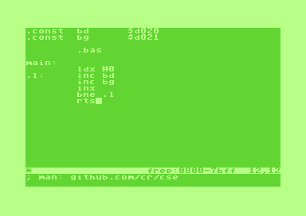

## Who it's for

CSE is built for two kinds of programmer, and it refuses to compromise
on either.

**The seasoned developer** who wants a sketchpad. An immediate-mode
6502 REPL with no toolchain, no build step, no context switch back to
the host OS. Try three versions of an inner loop, watch the cycle
count change, poke at the hardware, get out. The loop from "I want to
try something" to "I am watching it run" has no pipeline in the middle.

**The learner** who wants a first computer that does one thing
honestly. 64 KiB of RAM they can read all of, 56 documented CPU
instructions, a memory map that prints on one page, a screen that is
literally the command buffer. No browser tab, no notifications, no
package manager. The scope is finite, the ceiling is visible, and the
computer stops when the user does. Give them a 6502 book and the CSE
cheat sheet and they're ready to start.

The same design choices serve both — minimal footprint, maximum
workspace, fluent interaction, one environment instead of many tools —
because a beginner and an expert both benefit from a computer whose
surface area fits in their head.

For the longer story — why CSE exists, how it compares to its peers,
and what keeps the promise honest — see [background.md](background.md).

## Contents

- [Concepts](#concepts)
- [Quick start](#quick-start)
  - [Themes](#themes)
- [REPL commands](#repl-commands)
- [Error and warning messages](#error-and-warning-messages)
- [Editor](#editor)
- [Assembler syntax](#assembler-syntax)
- [Memory layout](#memory-layout)
- [Built-in symbols](#built-in-symbols)
- [Development](#development)

## Concepts

CSE has two modes: the **REPL** and the **editor**.  Press RUN/STOP
to switch between them.

The **REPL** is a command prompt for inspecting memory, assembling,
running, and debugging code.  Every command operates on the
*current address* shown in the `AAAA:` prompt.  Navigate with `@`,
`+`, `-`.

  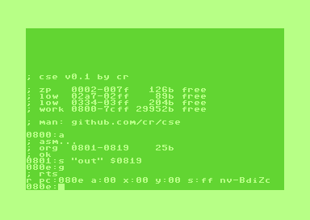

The **editor** is a full-screen text editor for writing assembly
source.  The `a` command in the REPL assembles the editor's content
into memory at the current address.

### The edit-assemble-run cycle

1. Write source in the editor (RUN/STOP to enter).
2. Switch back to the REPL (RUN/STOP).
3. Set the origin: `@ $C000` (or use `.org` in source).
4. Assemble: `a`
5. Run: `g` (jumps to `main:` label).
6. Inspect: `d` to disassemble, `m` to hex-dump, `r` for registers.
7. Debug: `b $C010` to set a breakpoint, `g` to run, `t` or `o` to step,
   `c` to continue.

Repeat.  The source stays in the editor buffer between runs.
Save the source with `s "PROJ"` — it stores the source as a SEQ file
with the project name.  Save the assembled binary with any PRG-mode
form (e.g. `s "PROJ" $end`) — it stores as `PROJ.` (trailing dot) so
source and binary never collide.

### Current address

The REPL prompt shows `AAAA:` — this is the *current address*.
It determines where `d`, `m`, `.`, `a`, `j` operate.  Set it
explicitly with `@ EXPR` or navigate with `+`/`-`.  After
assembly, the current address advances to the `main:` label
if one was defined.

### Block size

Commands like `d` (disassemble) and `m` (memory dump) operate on
a chunk of *block size* bytes.  Default is $10 (16).  Change it
with `B EXPR`.  `+` and `-` also advance/retreat by the block size.
`t` and `o` take an explicit step count: `t 5` steps five
instructions, bare `t` steps one (block size does not apply).

### Screen editing

`m`, `d`, and `$` output multiple lines to the screen.  For `m`
and `d`, each output line is a valid `.` command.  Move the
cursor to any line, edit the values directly on screen, and
press RETURN to execute the modified line.  This is the C64
screen-editor workflow: the screen *is* your input buffer.

For example, `d` might show:

    C000:. A9 42     LDA #$42
    C002:. 8D 20 D0  STA $D020
    C005:. 60        RTS

Cursor up to the first line, change `42` to `07`, press RETURN —
the byte at $C000 is now patched.

### Expressions

Anywhere CSE expects a number — command arguments, assembler
operands, directive values — you can use a full expression with
arithmetic, labels, and lo/hi byte operators.  See
[Assembler syntax](#expressions-1) for details.

## Quick start

    LOAD "CSE",8,1
    RUN

CSE boots into the REPL. Type commands at the `AAAA:` prompt.
Press RUN/STOP to toggle between the REPL and the source editor.

### Themes

CSE ships with thirteen built-in colour themes — pick one at
build time with `make THEME=NAME`, or change the live colours
with the `C` REPL command.

<table>
<tr>
  <td align="center">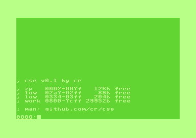 GREENLAND <i>(default)</i></td>
  <td align="center">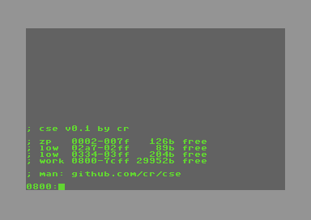 RADIOACTIVITY</td>
  <td align="center">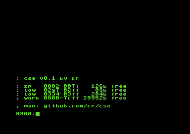 MATRIX</td>
  <td align="center">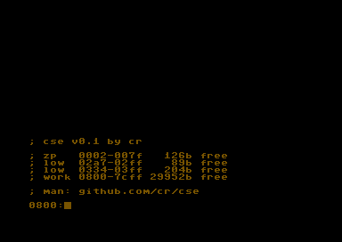 HERCULES</td>
</tr>
<tr>
  <td align="center">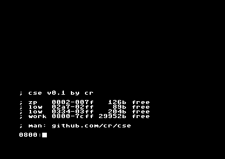 MILKYWAY</td>
  <td align="center"> LEEBRUCE</td>
  <td align="center">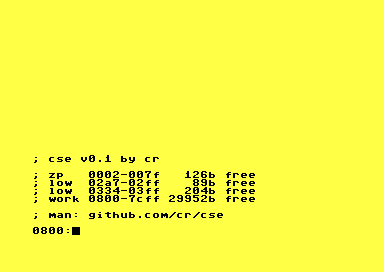 BRUCELEE</td>
  <td align="center">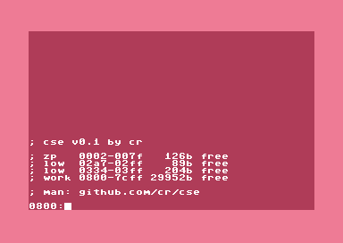 MRSPIGGY</td>
</tr>
<tr>
  <td align="center">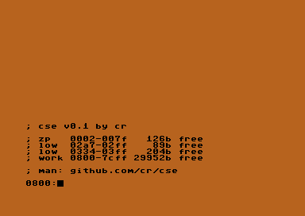 ORANGE</td>
  <td align="center">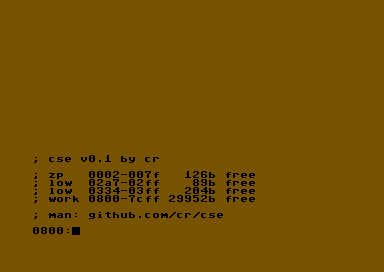 MUDDY</td>
  <td align="center">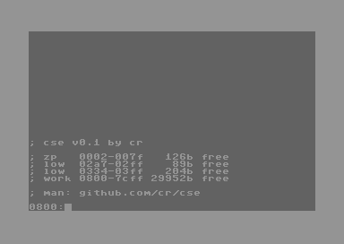 CLOUDY</td>
  <td align="center">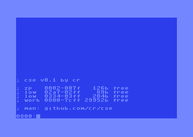 C64</td>
</tr>
<tr>
  <td align="center">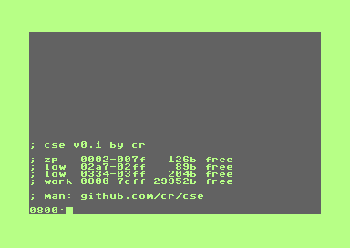 C128</td>
  <td colspan="3" align="left" valign="top">Or specify any 3-digit hex code directly: <code>make THEME=cb5</code> (border, background, foreground — C64 palette $0–$F).  At runtime, <code>C B G F</code> sets all three.</td>
</tr>
</table>

## REPL commands

### Navigation

| Command | Syntax | Description |
|---------|--------|-------------|
| `@` | `@ EXPR` | Set current address |
| `+` | `+ [EXPR]` | Advance by EXPR (default: block size) |
| `-` | `- [EXPR]` | Retreat by EXPR (default: block size) |
| `B` | `B [EXPR]` | Show or set block size (default $10) |

### Inspect and edit memory

| Command | Syntax | Description |
|---------|--------|-------------|
| `.` | `.` | Disassemble one instruction at current address |
| `.` | `. HH [HH] [HH]` | Poke 1--3 hex bytes at current address |
| `.` | `. MNEM [OPERAND]` | Assemble one instruction at current address |
| `d` | `d` | Disassemble block-size bytes |
| `m` | `m` | Hex+ASCII dump of block-size bytes |
| `m` | `m [HH] [HH] ...` | Edit up to 8 bytes at current address |
| `i` | `i` | Show full memory map |

  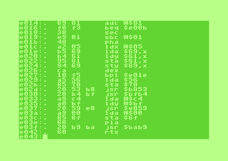
  &nbsp;&nbsp;
  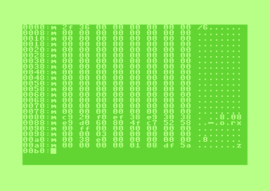

### Assembler

| Command | Syntax | Description |
|---------|--------|-------------|
| `a` | `a` | Assemble source from editor at current address |
| `u` | `u [MODE]` | Show or set CPU mode: `6502`, `6510`, `65c02` (available modes depend on build) |

After `a`, the current address advances past the assembled code.
If the source defines a `main:` label, `g` will jump there.

### Run and debug

| Command | Syntax | Description |
|---------|--------|-------------|
| `j` | `j [ADDR]` | Execute code at address (default: current) |
| `g` | `g` | Execute at label `main` |
| `t` | `t [EXPR]` | Step into (N instructions, default 1) |
| `o` | `o [EXPR]` | Step over (N instructions, default 1) |
| `c` | `c` | Continue from breakpoint (errors with `;?no ctx` if no active debug session) |
| `b` | `b` | List breakpoints |
| `b` | `b ADDR` | Set breakpoint (8 slots) |
| `b` | `b -N` | Delete breakpoint N |
| `b` | `b *` | Clear all breakpoints |
| `r` | `r` | Show registers (A, X, Y, SP, flags) |
| `r` | `r A:XX X:XX ...` | Set registers |

RUN/STOP+RESTORE triggers an NMI break into the debugger while
user code is running.  Pressed at the REPL prompt, it refreshes
the screen (classic C64 behaviour, preserves any active debug
session).

  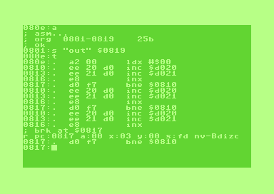

Stepping into a JSR whose target is in KERNAL ROM ($E000--$FFFF)
automatically falls back to step-over.

**Ending a debug session.**  If a break is active and you want
to start fresh without running to completion, use `R` (reset)
or just invoke a command that needs a clean stack (`a`, `l`) —
CSE will prompt `; end debug? y/n` and discard the break context
on yes.

### Files

| Command | Syntax | Description |
|---------|--------|-------------|
| `l` | `l "PROJ"` / `l "PROJ" 0` / `l "PROJ" $addr` / `l "PROJ,p"` | Load source (SEQ) or binary (PRG); `0` uses PRG header addr |
| `s` | `s "PROJ"` / `s "PROJ" $end` / `s "PROJ" $start $end` | Save source (SEQ) or binary (PRG) |
| `$` | `$ [DEVICE]` | Directory listing (default device 8) |

CSE is source-centric: a **project name** is a stem like `demo` that
stands for both the source and the binary.  Disk filenames are derived:
source is `demo` (SEQ), binary is `demo.` (trailing dot, PRG).  They
can't collide in the CBM DOS directory.

- Bare `l "demo"` / `s "demo"` loads/saves the **source**.
- Any address argument forces **PRG** mode: `s "demo" $2000` saves the
  binary as `demo.`; `l "demo" $c000` loads the binary to `$c000`,
  `l "demo" 0` loads at the PRG header address.
- Explicit `,s` or `,p` suffix bypasses derivation: `s "foo,p"` saves
  as literal `foo` PRG; `l "foo,s"` loads literal `foo` SEQ.
- Bare `s` or `l` (no string) reuses the last project name (default `out`).

PRG save addresses: one arg is end (start = cur_addr); two args are
start and end.  **End is inclusive** — `s "proj" $1000 $2000` saves
bytes `$1000..$2000` inclusive, i.e. `$1001` bytes.  If end ≤ start,
the arg is treated as a length (size = end).  End = 0 defaults the
size to `block_size`.

### Utility

| Command | Syntax | Description |
|---------|--------|-------------|
| `?` | `? EXPR` | Calculator -- shows hex, decimal, binary, signed |
| `C` | `C [B] [G] [F]` | Show or set colors (border, background, foreground) |
| `k` | `k` | Delete source (with confirmation) |
| `x` | `x` | Clear screen |
| `R` | `R` | Warmstart -- clears screen and ends any active debug session (with confirmation) |
| `Q` | `Q` | Quit CSE (with unsaved guard) |

Color values are single hex digits 0--F (C64 palette).
`C F` sets foreground only; `C B F` sets border+foreground;
`C B G F` sets all three.

**Recovering the display.**  If user code or a misbehaving program
has trashed the screen, press CLR/HOME or ESC at the REPL prompt
to redraw the CSE display.  Active debug context is preserved.

## Error and warning messages

CSE uses a BASIC-style `;?<tag>` for errors and `;!<tag>` for
warnings.  All tags are short and lowercase; the leading `;` makes
them easy to scan for in mixed log output.

### Errors (`;?`)

| Tag | Meaning |
|-----|---------|
| `;?syntax` | Generic parse / addressing-mode / unknown-mnemonic error |
| `;?cpu` | Mnemonic isn't valid for the current CPU mode (e.g. `PHY` on 6502, illegal opcodes on 65C02) |
| `;?expr <detail>` | Expression error.  `<detail>` is one of: `exp val` (expected a value), `ovfl` (overflow), `exp )` (mismatched parenthesis), `undef` (undefined symbol), `div0` (divide by zero) |
| `;?bad val` | Value out of range for the context (e.g. block size = 0) |
| `;?range` | Address outside permitted range (e.g. `b` setting a breakpoint outside workspace) |
| `;?cmd` | Unknown REPL command |
| `;?no name` | No filename available (and no remembered project name) |
| `;?no ctx` | Debugger command (`c`, `t`, `o`) issued with no active break |
| `;?fail` | Disk I/O failed |
| `;?too big` | File too large for the gap buffer |
| `;?full` | Symbol table full |

When the source assembler reports an error, the line number prefixes
the tag: `;?42 : undef` means undefined symbol on line 42.  The `;?42 :`
prefix replaces `;?expr ` for source-assembly errors (the line
number is more useful than repeating `expr`).

### Warnings (`;!`)

| Tag | Meaning |
|-----|---------|
| `;!unsaved` | Buffer has unsaved changes (gating prompts for `k`, `q`, `R`) |
| `;!debug` | An active debug session is being ended (gating prompts for `a`, `l`, `R`) |
| `;!a shadow` | Source line wrote `<acc-mne> A` (e.g. `ASL A`) but a label `A` is also defined.  The accumulator wins; the label is shadowed for that mnemonic.  Use a different name or write the address explicitly to access the label from one of the six ACC-accepting mnemonics. |
| `;!stk N` | Kernel stack approached its 64-byte budget — `N` is the decimal headroom remaining.  Indicates a deeply-nested user expression or a future kernel-recursion bug. |
| `;!range` | Step BRK arming refused outside `[workstart, workend]`. |

### Source-assembly line errors

These appear as `;?<line>: <message>` from the source assembler:

| Message | Cause |
|---------|-------|
| `bad insn` | Invalid mnemonic / addressing-mode combination |
| `bad val` | Numeric value out of range for the directive |
| `cpu` | CPU-gate rejection (same as REPL `;?cpu`) |
| `exp id` | `.const` expected an identifier name |
| `exp "` | `.str` / `.scr` expected an opening quote |
| `fwd ref` | Forward reference in `.res` / `.align` (the value drives the directive's pass-0 size — must be defined before use) |
| `sym full` | Symbol table full |
| `: truncated` | Source line was longer than 39 characters and got truncated by `ed_read_line` |

## Editor

Press RUN/STOP to enter the editor from the REPL and back.

| Key | Action |
|-----|--------|
| Printable | Insert character (39-column visual limit; refused with audible blip if at the cap or the buffer is full) |
| RETURN | Newline with auto-indent (see below; refused if the buffer is full) |
| DEL | Backspace |
| INS | Insert space at cursor (cursor stays; refused at cap / on full buffer) |
| Cursor keys | Navigate |
| HOME | Start of line |
| SHIFT+SPACE | Tab (to next tab stop; refused at cap / on full buffer) |
| RUN/STOP | Return to REPL |

**Smart indent.**  New lines start with a tab (SHIFT+SPACE).
Typing `:` slides the current line to column 0 — labels are
recognised by the colon and move to the left edge automatically.
RETURN after a colon also strips the gutter from the label line.

*Known quirk:* a colon in a comment (`; note:`) will also strip
the line's leading tab.  Re-add it with SHIFT+SPACE if needed.

The editor uses a gap buffer that grows downward from the CSE
runtime start address (determined at link time, typically ~$7B00).
The status bar shows the cursor position, line count, dirty flag,
and free bytes.

## Assembler syntax

Full syntax spec: [doc/assembler_syntax.md](doc/assembler_syntax.md)

### Source lines

    [label:]  [instruction | directive]  [; comment]

### Labels

    main:           ; global
    .loop:          ; local (scoped to last global)

Case-insensitive. Characters: a--z, 0--9, dot.

### Addressing modes

    LDA #$42        ; immediate
    LDA $42         ; zero page
    LDA $42,X       ; zero page,X
    LDA $1000       ; absolute
    LDA $1000,X     ; absolute,X
    LDA $1000,Y     ; absolute,Y
    LDA ($42,X)     ; (indirect,X)
    LDA ($42),Y     ; (indirect),Y
    JMP ($1000)     ; indirect
    LDA ($42)       ; zero page indirect (65C02 build only)
    JMP ($1000,X)   ; absolute indirect,X (65C02 build only)
    ROL             ; accumulator (bare form)
    ROL A           ; accumulator (explicit form, equivalent)
    BEQ .loop       ; relative (assembler computes offset)

### Directives

    .org $C000              ; set origin
    .const NAME EXPR        ; define constant
    .cpu 6502               ; set CPU mode
    .db $41, $42, 0         ; emit bytes
    .dw $1234, label        ; emit words (little-endian)
    .str "hello", 0         ; emit PETSCII string
    .scr "HELLO"            ; emit screen codes
    .res 256, $EA           ; reserve and fill
    .align 256              ; align to boundary
    .bas                    ; emit BASIC SYS stub
    .bas "title"            ; emit BASIC SYS stub with REM

### Expressions

Anywhere a value is expected:

    LDA #<screen            ; lo byte
    STA table+40            ; arithmetic
    LDX #cols-1             ; constant
    LDA #mask & $0F         ; bitwise

Number formats: `$FF` hex, `42` decimal, `%10101010` binary, `*` PC.

Operators (loosest to tightest):

    \pounds & ^             ; OR AND XOR
    + -                     ; add subtract
    * / << >>               ; multiply divide shift
    - ! < >                 ; negate NOT lo-byte hi-byte (unary)
    ( )                     ; grouping

Width rule: `$XX` (1--2 hex digits) is zero-page; `$0XX`+ (3--4
digits) forces absolute.  Width is sticky across operators.

### Example

    .cpu 6502
    .org $C000

    .const border $D020

    main:   ldx #0
    .loop:  stx border
            ldy #4
    .wait:  dey
            bne .wait
            inx
            bne .loop
            rts

Assemble and run:

    C000:a          ; assemble
    g               ; run (jumps to main:)

## Memory layout

At startup CSE shows the free memory available:

      zp 0002-007F       37b free
    lo02 02A7-02FF       89b free
    lo03 0334-03FF      204b free
    work 0800-XXXX    NNNNNb free

| Region | Address | Use |
|--------|---------|-----|
| User ZP | $0002--$007F | Your zero-page variables (saved/restored across run) |
| Low page 2 | $02A7--$02FF | Free RAM (89 bytes) |
| Low page 3 | $0334--$03FF | Free RAM (204 bytes, includes tape buffer) |
| Screen | $0400--$07FF | VIC-II screen RAM |
| Workspace | $0800--workend | Your programs and data |
| CSE | workend+1--$CFFF | CSE runtime code and data |
| I/O | $D000--$DFFF | VIC-II, SID, CIA |
| KERNAL ROM (and CSE data behind it) | $E000--$FFFF | Symbol table, lookup tables, REPL screen save, KERNAL ROM, NMI/BRK vectors |

CSE unmaps BASIC ROM, so the full $0800--$CFFF range is available
as contiguous workspace.  Several large CSE structures (symbol
table, name heap, lookup tables, REPL screen save) live in RAM
under KERNAL ROM at $E000+; CSE banks the KERNAL out temporarily
when accessing them.  The NMI ($FFFA) and IRQ/BRK ($FFFE) vectors
are patched to CSE handlers so RUN/STOP+RESTORE and `BRK` route
through the debugger.  See [doc/memory_design.md](doc/memory_design.md)
for the full address-by-address breakdown.

### What your code can use

When you run code with `j`, `g`, `t`, or `o`, your program may
freely use:

- **$02--$7F** — CSE saves and restores these across your run.
- **$02A7--$02FF** — 89 bytes of free low RAM.
- **$0334--$03FF** — 204 bytes (tape buffer at $033C--$03FB is
  included; restore it if you need tape I/O).
- **$0800--workend** — your workspace.

Your code **must preserve:**

- **$80--$FF** — KERNAL zero page.
- **$0100--$01FF** — hardware stack (use normally, but balance
  pushes and pops).
- **$0200--$02A6** — KERNAL editor state.
- **$0300--$0333** — KERNAL/CSE vectors.

Your code may use KERNAL I/O (CHROUT, GETIN, etc.) normally.
CSE restores screen colors, charset, and cursor state on return.
If your code clears or repaints the screen, type `x` in the
REPL to restore the display.

## Built-in symbols

| Symbol | Value | Description |
|--------|-------|-------------|
| `workstart` | first free byte after CSE | Start of workspace |
| `workend` | CSE runtime start - 1 (adjusts with editor) | End of workspace |

Use in assembler: `.org workstart`

Use in REPL: `@ workstart`, `j workstart`

## Development

### Quick start

    make            # build cse.prg (requires ca65/ld65)
    make run        # build + launch in VICE
    make test       # run pytest test suite (requires py65)

### Documentation

All design docs, module specs, and project goals live in
[`doc/`](doc/README.md).

### Build requirements

- [cc65](https://cc65.github.io/) -- provides `ca65` (assembler)
  and `ld65` (linker).  CSE is pure 6502 assembly; the cc65
  C compiler is not used.
- [VICE](https://vice-emu.sourceforge.io/) -- C64 emulator
  (for `make run`)
- Python 3 + [py65](https://pypi.org/project/py65/) -- test harness
- pipenv or virtualenv for the test environment
- C64 KERNAL ROM for testing (copied from VICE; see `make test`)
